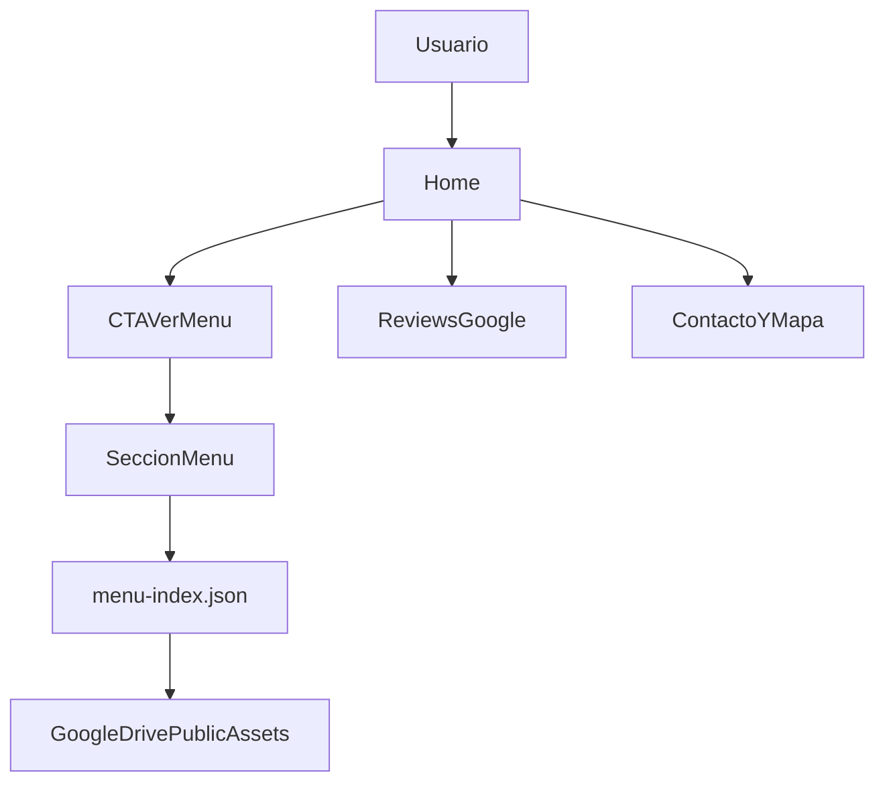

# Don Franco | Restaurante Artesanal - Requisitos del Sistema y Guía Técnica

## 1) Objetivo del proyecto

Construir una web institucional con foco en conversión al menú digital (imágenes PNG), consumiendo assets desde Google Drive público y desplegada en un Droplet de DigitalOcean con auto deploy desde GitHub.

## 2) Objetivos de negocio y producto

- Llevar al usuario al menú en 1-2 clics.
- Mostrar información institucional confiable: historia, galería, contacto, ubicación y reputación.
- Mantener operación simple para el equipo: actualizar menú sin tocar servidor manualmente.
- Lograr buena experiencia móvil (principal canal de descubrimiento local).

## 3) Alcance funcional (MVP)

La Home será una landing de una sola página con secciones:

1. `Hero` con propuesta de valor + CTA a menú.
2. `Menú` (bloque principal) con categorías y tarjetas de imágenes PNG formato A4.
3. `Historia` / identidad de marca.
4. `Galería` de fotos institucionales.
5. `Valoraciones` (Google Maps).
6. `Contacto` (teléfono, WhatsApp, horario, dirección).
7. `Mapa` embebido de Google Maps.
8. `Footer` con datos legales y redes.

Fuera de alcance en MVP:

- Panel administrativo.
- Backend propio.
- Checkout/pedidos en línea.

## 4) Requisitos no funcionales

### Rendimiento

- LCP objetivo: `< 2.5s` en móvil 4G.
- CLS objetivo: `< 0.1`.
- Cargar imágenes con `loading="lazy"` fuera de primer viewport.
- Preload de fuente de títulos y logo principal.
- Las imágenes del menú en formato A4 deben servirse optimizadas para web (no entregar el PNG original de impresión cuando no sea necesario).

### SEO local

- Metadatos completos (`title`, `description`, OG, canonical).
- `JSON-LD` tipo `Restaurant`.
- `sitemap.xml` y `robots.txt`.

### Accesibilidad

- Contraste mínimo WCAG AA.
- Alt text obligatorio para cada imagen de menú/galería.
- Navegación por teclado para enlaces y botones críticos.

### Seguridad y operación

- HTTPS obligatorio.
- Headers de seguridad en Nginx (HSTS, X-Frame-Options, X-Content-Type-Options, Referrer-Policy).
- Deploy con usuario no root.
- Rollback simple en caso de fallo.

## 5) Decisión de stack (recomendada)

## Stack elegido

- **Framework:** Astro (sitio estático).
- **Estilos:** CSS nativo con design tokens (variables CSS).
- **Contenido dinámico:** JSON versionado en repo (`content/menu-index.json`).
- **Hosting:** DigitalOcean Droplet + Nginx sirviendo archivos estáticos.
- **CI/CD:** GitHub Actions + SSH + `rsync`.

## Justificación

- El sitio es principalmente de contenido y navegación rápida al menú, ideal para SSG.
- Menos complejidad y costo que SSR/backend.
- Muy buen rendimiento y SEO por defecto.
- Flujo de mantenimiento claro para un equipo pequeño.

## Límites del enfoque

- Sin backend, la personalización avanzada en tiempo real es limitada.
- Cambios de contenido estructurado requieren commit (o automatización adicional).

## 6) Estructura de información y navegación

Flujo deseado:

1. Usuario entra.
2. Ve CTA principal "Ver Menú".
3. Llega a sección de categorías con imágenes.
4. Tiene accesos secundarios a contacto, mapa y reseñas.



## 7) Estructura técnica del proyecto

Ruta propuesta:

- `/src/pages/index.astro` - Página principal.
- `/src/components/` - Bloques reutilizables (`Hero`, `MenuSection`, `Reviews`, etc.).
- `/src/styles/tokens.css` - Variables de marca y escalas.
- `/content/menu-index.json` - Índice del menú y metadatos de imágenes.
- `/public/` - Assets locales de fallback (logo, íconos).
- `/docs/PROJECT_REQUIREMENTS.md` - Este documento.

## 8) Paleta de colores y lineamientos visuales

Fuente: `paleta de colores.png`.

Valores visibles en arte de referencia:

- Negro: `#0F0F0F`
- Superficie: `#1A1A1A`
- Dorado (acento): `#C8A96A`
- Gris (detectado): `#BFBBFF` (se recomienda normalizar a `#BFBFBF`)
- Blanco (detectado): `#F2F222` (se recomienda normalizar a `#F2F2F2`)

Tokens sugeridos:

```css
:root {
  --color-bg: #0f0f0f;
  --color-surface: #1a1a1a;
  --color-accent: #c8a96a;
  --color-muted: #bfbfbf;
  --color-text: #f2f2f2;
  --color-border: #2a2a2a;
}
```

Tipografías de referencia de la paleta:

- Títulos: `Bebas Neue`, alternativa `Oswald`.
- Texto: `Montserrat`, alternativa `Inter`.

## 9) Modelo de datos del menú

Archivo fuente: `/content/menu-index.json`

Ejemplo recomendado:

```json
{
  "updatedAt": "2026-02-15T16:00:00Z",
  "menuVersion": "2026.02.15",
  "categories": [
    {
      "id": "parrillas",
      "title": "Parrillas",
      "order": 1,
      "items": [
        {
          "id": "parrilla-clasica-01",
          "title": "Parrilla Clasica",
          "description": "Corte mixto artesanal",
          "image": {
            "fileId": "1AbCdEfGhIjKlMnOpQrStUvWxYz",
            "url": "https://drive.google.com/uc?export=view&id=1AbCdEfGhIjKlMnOpQrStUvWxYz"
          },
          "alt": "Parrilla clasica de Don Franco",
          "isFeatured": true
        }
      ]
    }
  ]
}
```

Reglas:

- `id` únicos y estables.
- `order` numérico para ordenar categorías.
- `alt` obligatorio.
- No usar links compartidos largos; guardar `fileId` y construir URL.
- Cada item de menú corresponde a una página en PNG tamaño A4 (vertical por defecto).

## 10) Convención de Google Drive (público)

Estructura sugerida en Drive:

- `DON_FRANCO_SITE/`
  - `MENU/`
    - `PARRILLAS/`
    - `HAMBURGUESAS/`
    - `BEBIDAS/`
  - `GALERIA/`
  - `LOGOS/`

Reglas de nombre:

- Formato: `YYYYMMDD_categoria_slug_v01.png`
- Solo minúsculas, números y guion bajo en `slug`.
- Mantener histórico (subir nueva versión, no sobrescribir sin control).

Tipos de enlace:

- Vista directa: `https://drive.google.com/uc?export=view&id=FILE_ID`
- Descarga: `https://drive.google.com/uc?export=download&id=FILE_ID`

Fallback recomendado:

- Si falla Drive, mostrar placeholder local en `/public/fallback/*.png`.

Especificación para PNG A4 del menú:

- Relación de aspecto esperada: `1:1.414` (A4 vertical).
- Resolución fuente recomendada para archivo maestro: `2480x3508` (A4 a 300 DPI).
- Para visualización web, generar variante optimizada de menor peso (manteniendo proporción A4) para reducir tiempos de carga en móvil.
- UI recomendada: visor tipo "página" con `object-fit: contain`, fondo oscuro y opción de abrir imagen completa en nueva pestaña.

## 11) Integración de valoraciones de Google Maps

Opciones:

1. **Rápida (MVP):** bloque manual con rating, cantidad y enlace al perfil de Google Maps.
2. **Escalable:** consumo de Places API con key restringida por dominio/IP.

Para MVP se recomienda la opción 1 para evitar costo/latencia y complejidad de quota.

## 12) Despliegue en DigitalOcean

## Arquitectura de servidor

- SO recomendado: Ubuntu LTS.
- Web server: Nginx.
- Ruta app: `/var/www/donfranco`.
- Releases:
  - `/var/www/donfranco/releases/<timestamp>/`
  - `/var/www/donfranco/current` -> symlink release activa.

## Nginx (base)

```nginx
server {
  listen 80;
  server_name donfranco.com www.donfranco.com;

  root /var/www/donfranco/current;
  index index.html;

  location / {
    try_files $uri $uri/ /index.html;
  }

  location ~* \.(js|css|png|jpg|jpeg|gif|svg|webp|woff2)$ {
    expires 30d;
    add_header Cache-Control "public, immutable";
  }
}
```

SSL:

- Configurar Let’s Encrypt con `certbot`.
- Forzar redirección HTTP -> HTTPS.

## 13) Auto deploy con GitHub Actions

Estrategia:

1. Push/Merge a `main`.
2. CI instala dependencias y hace build.
3. Publica build por SSH al Droplet en un nuevo release.
4. Actualiza symlink `current`.
5. Ejecuta health-check básico.

Secrets requeridos:

- `DO_HOST`
- `DO_USER`
- `DO_PORT` (opcional, default 22)
- `SSH_PRIVATE_KEY`
- `KNOWN_HOSTS`
- `DEPLOY_PATH` (ejemplo `/var/www/donfranco`)

Workflow de referencia:

```yaml
name: Deploy Don Franco

on:
  push:
    branches: [main]

jobs:
  deploy:
    runs-on: ubuntu-latest
    steps:
      - uses: actions/checkout@v4
      - uses: actions/setup-node@v4
        with:
          node-version: 20
          cache: npm
      - run: npm ci
      - run: npm run build
      - name: Setup SSH
        run: |
          mkdir -p ~/.ssh
          echo "${{ secrets.SSH_PRIVATE_KEY }}" > ~/.ssh/id_ed25519
          chmod 600 ~/.ssh/id_ed25519
          echo "${{ secrets.KNOWN_HOSTS }}" > ~/.ssh/known_hosts
      - name: Upload release
        run: |
          RELEASE=$(date +%Y%m%d%H%M%S)
          ssh -p "${{ secrets.DO_PORT || 22 }}" "${{ secrets.DO_USER }}@${{ secrets.DO_HOST }}" "mkdir -p ${{ secrets.DEPLOY_PATH }}/releases/$RELEASE"
          rsync -az --delete -e "ssh -p ${{ secrets.DO_PORT || 22 }}" dist/ "${{ secrets.DO_USER }}@${{ secrets.DO_HOST }}:${{ secrets.DEPLOY_PATH }}/releases/$RELEASE/"
          ssh -p "${{ secrets.DO_PORT || 22 }}" "${{ secrets.DO_USER }}@${{ secrets.DO_HOST }}" "ln -sfn ${{ secrets.DEPLOY_PATH }}/releases/$RELEASE ${{ secrets.DEPLOY_PATH }}/current && sudo systemctl reload nginx"
```

Rollback:

- Cambiar symlink `current` a la release anterior y recargar Nginx.

## 14) Proceso de actualización de contenido (operativo)

Ver guía paso a paso: [CONTENT_UPDATE_RUNBOOK.md](CONTENT_UPDATE_RUNBOOK.md).

## Menú (flujo estándar)

1. Subir PNG nuevos a carpeta Drive correcta.
2. Copiar `fileId` de cada imagen.
3. Editar `/content/menu-index.json`.
4. Abrir Pull Request con cambios.
5. Revisar en preview.
6. Merge a `main`.
7. Deploy automático.

## Galería institucional

- Mismo flujo, con sección `gallery` en JSON (opcional en misma fuente o archivo separado).

## 15) QA checklist (pre y post deploy)

Pre deploy:

- Carga Home en móvil y desktop.
- CTA principal abre sección de menú.
- Todas las imágenes de Drive responden `200`.
- No hay imágenes rotas ni alt vacíos.
- Mapa y enlaces de contacto funcionan.

Post deploy:

- Certificado SSL válido.
- Lighthouse móvil aceptable (Performance > 80, SEO > 90, Accessibility > 85).
- Logs Nginx sin errores críticos.
- Validar rollback documentado.

## 16) Riesgos y mitigaciones

- **Google Drive rate limit o bloqueo temporal:** cache agresiva y fallback local.
- **Links mal formados o IDs erróneos:** validación automática en CI de URLs del JSON.
- **Cambios de diseño sin control:** mantener tokens y guideline en este documento.
- **Dependencia de una persona para deploy:** CI/CD + runbook documentado.

## 17) Roadmap técnico

Fase 1 (MVP):

- Landing completa con menú desde Drive y despliegue automatizado.

Fase 2:

- Analítica (GA4/Plausible).
- Gestión de contenido asistida (script de sincronización Drive -> JSON).
- Multi idioma (ES/EN).
- Integración con reseñas dinámicas vía Places API.

## 18) Criterios de aceptación del proyecto técnico

- Existe un documento único y vigente para decisiones técnicas, operación y despliegue.
- Cualquier desarrollador puede montar proyecto, desplegar y actualizar menú con esta guía.
- El deploy es reproducible y el rollback está definido.
